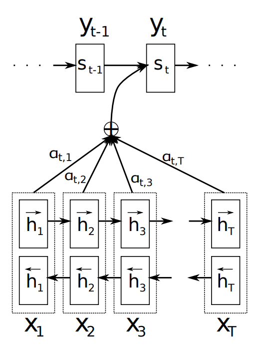

# Attention机制

人类在阅读或者观察事物的时候，往往是有针对性的，他不可能一下子记住所有的东西，而是会有选择的关注到一些重点，基于这种直觉，我们将人类学习和理解事物的特点用到深度学习里面，就有了Attention机制。

我最早看到Attention机制的时候大概是在Google的神经翻译模型里面，这东西对模型表现有很好的效果，再后来2017年的时候有一篇轰动一时的论文《Attention is all you need》把attention弄到了一个更加重要的位置，虽然一开始并没有造成多大的冲击，但是在2018年之后，attention机制逐渐开始一统江湖。

于是，我们就从最早的最流行的编码-解码模型来认识什么是attention,其本质上就是加权平均。

直观的说，Encoder-Decoder框架是一个序列到另一个序列的转换，它的输入和输出是一个句子对(source, target)，即目标是通给定句子$source = (x_1, x_2,...,x_m)$，通过encoder-decoder转换为目标$target=(y_1, y_2, ...,y_n)$。

在没有attention的情况下，这个转换应该是这样的：

首先将source通过一个编码器的非线性变化$f​$转换成一个中间语义状态C：
$$
C=f(x_1,x_2,...,x_m)
$$
然后进入解码器，预测target的一个一个的词，此时第$t​$ 个输出$y_t​$除了和编码器的$C​$ 有关，还和前面的$y_1，y_2,...y_{t-1}​$ 有关，我们将这个非线性过程用$g​$表示:
$$
y_t = g(C;y_1,y_2,...,y_{t-1})
$$
也就是说，所有的$y_t$ 都和同样的 $C$ 有关，这显然是不合理的。比如我们的Encoder-Decoder框架是要翻译“I am a student”到"我 是 一个 学生"，显然，对于“学生”这个词来说，起决定性作用的源语句应该是“student”，而对于“一个”，起决定性作用的应该是"a"，统一使用$C$ 的话，就相当于没有抓住重点，可以想象这种相对于人类而言丢失的信息必然会对模型的效果产生不良影响。

于是我们引入注意力机制，像这样，我们给翻译的中文词受到源句子中英文词的不同影响程度给出一个概率分布的权重：
$$
(I, 0.1), (am, 0.1), (a, 0.1), (student, 0.7)
$$
每个单词的概率权重代表了翻译“学生”这个词时，模型分配在不同英文单词上的注意力，这对于正确翻译出目标词汇显然是有帮助的。

同理，我们翻译任何一个词时，都会产生一个基于原句子的权重概率来表示每个词对目标词汇产生影响的大小，于是上面的公式可以改成这样：
$$
C_i=f_i(x_1,x_2,...,x_m)
$$

$$
y_t = g(C_i; y_1,y_2,...,y_{t-1})
$$

每个$C_i$ 对应着不同的源句子单词的注意力分配概率分布，我们用$h$ 函数表示Encode部分对输入单词的某种特征提表示，同理用$s$ 函数表示目标词的某种特征表示，用$ a_{ij}$ 表示源语句中第$j$ 个词相对于第 $i$ 个目标词的注意力，然后$C_i$ 就可以表示成
$$
C_i = \sum_{j=1}^n a_{ij}h(x_t)
$$
然后，现在问题来了，这个注意力概率分布到底怎么计算呢？

先抛开encoder-decoder，来看一下通用的attention机制的基本思想：

从source获取到(key, value), 然后计算目标query与每个key的相似性，然后用$softmax$ 归一化就得到了注意力概率分布，之后利用注意力概率分布权重对$value$ 加权求和，再激活一下就得到了状态向量$C$

而要计算源句子词汇和目标词汇的相似性或者相关性，方法就有很多了，下面就来说一下常见的三种注意力形式：additive attention 、 multiplication attention、self-attention。

### additive attention

这是最经典的注意力机制，它使用一个有隐藏层的全连接网络来计算注意力的分配：
$$
a_i = softmax(v^T tanh(W_1h(x_j) + W_2s(y_i)))
$$
在上面的encoder-decoder中，$v$ 和 $h$ 是同一个。

### multiplication attention

这是一种非常简化的注意力操作，直接通过向量点击来获取关联，同样softmax激活获取概率分布：
$$
a_i = softmax(h_i^TWs_i)
$$

### self-attention

顾名思义，这种注意力机制不再依赖于target，而是会计算源句子中每个词相对于其他词汇的注意力。因此，self attention计算过程中将会把句子中任意两个单词给联系起来，有效解决了远距离依赖的难题。因此后来使用非常广泛，并为后来的transformer奠定了基础，因此我们重点来详细介绍一下self-attention的原理，看看如何从输出一步步从source到attention概率分布到输出。[这里的内容主要参考了这篇很火的文章](https://jalammar.github.io/illustrated-transformer/)

**第一步，**将输入词汇embedding成词向量，然后使用编码器，对每个词向量生成三个向量：$query-vec, key-vec, value-vec$ ,生成方法是分别乘以三个矩阵$w^q, w^k, w^v$  ,这些矩阵在训练过程中需要学习，不过这三个矩阵是所有输入共享的。注意到这些新向量的维度比输入词向量维度要小($512 \to 64$) ,并不是必须要小的，是为了让multi-head attention的计算更稳定。考虑两个单词输入的例子：

**第二步，**计算attention就是计算一个得分，对于"Thinking Machines" 这句话，对"Thinking"计算attention分值，我们要计算句子中每个词对于"Thinking"的注意力得分，这个分值，通过“Thinking”对应的$query-vec​$ 与每个词的$key-vec​$ 依次点积获得。所以当我们处理位置#1时，第一个分值是$q_1​$和$k_1​$的点积，第二个分值是$q_1​$和$k_2​$的点积。

**第三步和第四步，**是将得分除以$\sqrt {dim_{key}}$ ,这里是8，这样做会使梯度更加稳定，然后加上$softmax$ 操作，转化为加和为1的概率分布。

这个softmax得分决定了每个单词在这个位置要表达多少，显然，这个位置的单词具有最高的softmax得分，但有时关注当前单词相关的另外一个词十分有用。就比如说我们有一个单词“bank”，单独看它本身，它可能是银行也可能是河岸，但是如果注意到它周边的词“river”,我们就知道它是河岸的意思了。这是self-attention的直观作用。

**第五步，**将softmax分值和value-vec按位置分别相乘，保留关注的value值，削弱不相关的value值。

**第六步，**将所有加权向量相加，产生该位置的self-attention输出。

然后我们把上面单一的向量运算改成矩阵的形式，

self-attention 还有一种多头的形式，其实就是类似于卷积网络的多个卷积核，相对于之前的一组矩阵$w^q, w^k, w^v$ ,现在是多组的矩阵，它将在两个方面提高attention层的效果：

1. 这种机制扩展了模型集中于不同位置的能力，在上面例子中，$z$ 包含了其他词很少的信息，基本只由实际的词决定，在其他情况下，比如翻译"The animal didn’t cross the street because it was too tired" 时，我们想知道"it" 指代的是什么
2. 多头机制赋予了attention多种子表达方式，就像下面这个例子所示，在多头下有多组query/key/value-matrix，而非仅仅一组（论文中使用8-heads）。每一组都是随机初始化，经过训练之后，输入向量可以被映射到不同的子表达空间中。

如果我们计算multi-headed self-attention的，分别有八组不同的Q/K/V matrix，我们得到八个不同的矩阵。

这会带来点麻烦，前向网络并不能接收八个矩阵，而是希望输入是一个矩阵，所以要有种方式处理下八个矩阵合并成一个矩阵，然后将它们乘以一个其他权重矩阵$W^o$

以上就是attention机制的全部内容，再了解了attention之后，我们再去看一下transformer的实现原理。

参考资料：

[The Illustrated Transformer](https://jalammar.github.io/illustrated-transformer/)