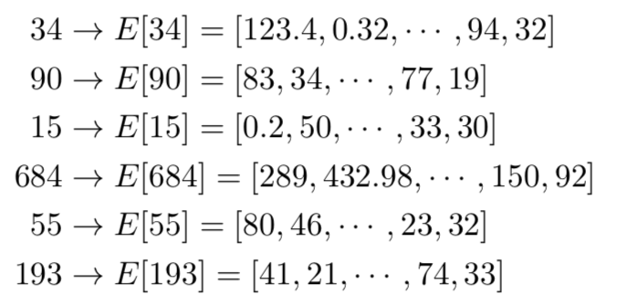
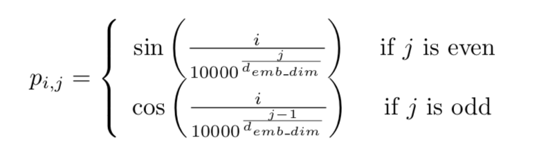
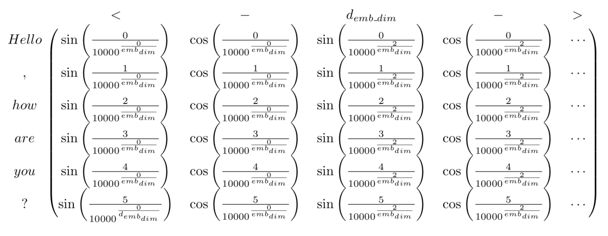
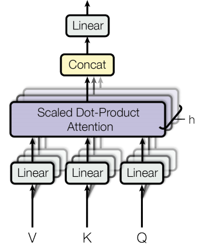

# 详解Bert原理

离开深度学习瞎折腾了一段时间后，我终于又回来了。

于是赶紧回顾了下18年之后NLP的发展，基本就是将迁移学习更广泛的用于NLP领域，以及把17年年底的《Attention is all you need》里的思想给发扬光大了，ELMO弥补了传统word2vec多义词表示的不足，GPT使用更强大的特征提取器Transformer取代LSTM，Bert使用双向Transformer进一步改进了GPT成为这两年发展的集大成者。

从Bert模型所带来的NLP界里程碑式的影响和所取得的成就来看，无疑Bert将会是未来两三年NLP应用发展的基石，于是有必要仔细的看看其模型的结构，数据是如何流动的，训练的和测试的。

不得不说现在的学习环境相对几年前好太多了，本文主要参考了以下几篇文章：

[Dissecting BERT Part 1: The Encoder](https://medium.com/dissecting-bert/dissecting-bert-part-1-d3c3d495cdb3)

[The Illustrated Transformer](https://jalammar.github.io/illustrated-transformer/)

[Dissecting BERT Appendix: The Decoder](https://medium.com/dissecting-bert/dissecting-bert-appendix-the-decoder-3b86f66b0e5f)

它的总体框架同lstm时代的MNT或者是attention is all you need中的**transformer**一样的**encoder-decoder**结构：

我们先来介绍一下Encoder部分。

## Encoder

为了理解这个架构，我们使用一个简单的具体的例子，来看一下**输入**的数据是怎么通过**encoder**一步一步变化让后到**输出**的。

### 从词到向量

bert的词嵌入由三个嵌入token embedding、segment embedding,和position embedding叠加而成。

#### Token embedding

这个过程跟以往的RNNs没什么区别，比如给定一个句子:

> Hello, how are you?

第一步是先将其标记化：

> “ Hello, how are you?” → [“Hello”,  “,” ,  “how”,  “are”,  “you”,  “?”]

然后是数字化，将每个标记映射到语料词汇表中的唯一整数编号：

> [“Hello”, “, “, “how”, “are”, “you”, “?”] → [34, 90, 15, 684, 55, 193]

接下来就是得到序列中每个词的词嵌入，也就是将整数映射到一个$emb\_dim​$ 维的向量，这个向量是模型在训练时学习的，你可以将其视为一个查表的过程，这些向量的元素作为模型的参数，像其他权重一样通过反向传播进行了优化。

在论文中是使用WordPiece tokenization 来将英文单词转换成768（$emb\_dim $）维的向量,转化的过程类似这样：

把每个词的向量放到一起，就得到了一个**句子长度x向量维度**($input\_length * emb\_dim​$) 尺寸的矩阵**Z**:

说明一点，我们通常使用**填充**的方式来让输入序列具有相同的长度，比如通过添加"\<pad\>" 标记来增加某些序列的长度，还是前面的例子，填充后可能变为：

> [“\<pad\>”, “\<pad>”, “\<pad>”, “Hello”,  “, “,  “how”,  “are”,  “you”,  “?”] →
>
> [5, 5, 5, 34, 90, 15, 684, 55, 193]

如果设定$ input\_length ​$设定为9，那我们就把句子从5填充到了9。

#### Positional Encoding

但是，上面的embedding并没有包含词的位置信息。于是，我们的目标是能够根据词在句子中的位置适当调整这个向量，使它带上位置信息。

作者选择的方法是使用预定的（非学习的）正余弦函数将$[-1,1] $ 之间的数字加到前面的embedding中，即通过正余弦函数将位置表示为彼此的线性组合，从而实现网络学习中标记位置之间的相对关系。在Token embedding 获得的矩阵$Z$ 的基础上加上位置矩阵$P​$  。

数学上，用$i$ 表示序列中标记的位置，用$j$ 表示token embedding特征向量中的位置：

具体来说，对于给定的句子$P$ ,其位置嵌入矩阵为：

作者解释说，使用这种确定性方法的结果和学习位置表示（就像我们对词嵌入那样）的结果差不多，因此这样反而会有一些优势：

- input_length 可以无限长，因为函数可以计算任意位置
- 需要学习的参数更好啊，训练更快

因此，添加了位置信息之后的矩阵是:
$$
X = Z + P
$$
它是第一个encoder块的输入，尺寸是$input\_length * emb\_dim ​$

### Encoder block

共有N个编码器块连接在一起直到生成编码器的输出，特定的块负责查找输入表示之间的关系并将编码在其输出中。

直观地，通过这些块的迭代过程将帮助神经网络捕获输入序列中的词之间的更加复杂的关系，你可以把它理解成一个整体用来捕捉输入序列的语义。

#### Multi-Head Attention

encoder中使用Transformer的多头注意力机制，这意味着它将计算$h$ 份不同权重矩阵的自注意力，然后将结果连接在一起。

这些并行注意力计算的结果称之为Head,我们用下标$i$ 来表示一个特定的head和相关的权重矩阵。

如上图所示，一旦计算了所有head，它们将被连接起来，得到一个尺寸为$input\_length *（h *d_v)$ 的矩阵，然后将它乘以一个尺寸为$ (h * d_v) * emb\_dim$ 的权重矩阵$W^0$  进行线性变换，就得到了一个尺寸为$(input\_length) * emb\_dim​$ 的最终结果，用数学公式表示就是：
$$
MultiHead(Q,K,V) = Concat(head_1,...,head_h)W^0 \\
where ~~head_i = Attention(XW_i^Q,XW_i^K,XW_i^V)
$$
其中的$Q, K, V$ 通过$X​$ 乘以相应权重矩阵$W_i^Q$获得，我们通过一个简单的例子来可视化的看一下这个过程。

这图描绘了输入标记通过 token embedding 和 positional encoding ，再输入到Encoder：

接下来，我们再来看下Encoder中的操作过程，先看一下单头的self-attention：

上图描绘了$Q (Querys), K(Keys) , V(Values)​$ 是怎么来的

