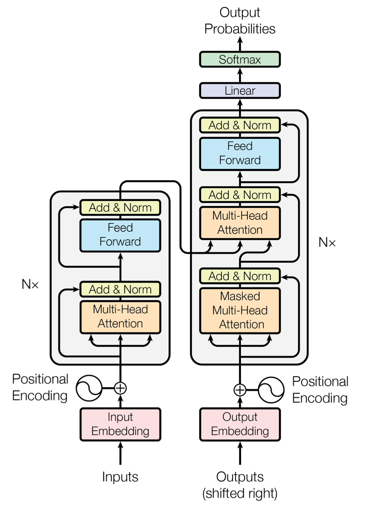

# 详解Bert原理

离开深度学习瞎折腾了一段时间后，我终于又回来了。

于是赶紧回顾了下18年之后NLP的发展，基本就是将迁移学习更广泛的用于NLP领域，以及把17年年底的《Attention is all you need》里的思想给发扬光大了，ELMO弥补了传统word2vec多义词表示的不足，GPT使用更强大的特征提取器Transformer取代LSTM，Bert使用双向Transformer进一步改进了GPT成为这两年发展的集大成者。

从Bert模型所带来的NLP界里程碑式的影响和所取得的成就来看，无疑Bert将会是未来两三年NLP应用发展的基石，于是有必要仔细的看看其模型的结构，数据是如何流动的，训练的和测试的。

不得不说现在的学习环境相对几年前好太多了，本文主要参考了以下几篇文章：

[Dissecting BERT Part 1: The Encoder](https://medium.com/dissecting-bert/dissecting-bert-part-1-d3c3d495cdb3)

[The Illustrated Transformer](https://jalammar.github.io/illustrated-transformer/)

[Dissecting BERT Appendix: The Decoder](https://medium.com/dissecting-bert/dissecting-bert-appendix-the-decoder-3b86f66b0e5f)

它的总体框架同lstm时代的MNT或者是attention is all you need中的**transformer**一样的**encoder-decoder**结构：

我们先来介绍一下Encoder部分。

## Encoder

为了理解这个架构，我们使用一个简单的具体的例子，来看一下**输入**的数据是怎么通过**encoder**一步一步变化让后到**输出**的。

### 从词到向量

这个过程跟以往的RNNs没什么区别，比如给定一个句子:

> Hello, how are you?

第一步是先将其标记化：

