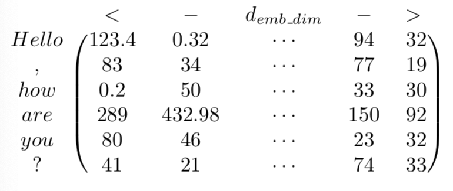

# 详解Bert原理

离开深度学习瞎折腾了一段时间后，我终于又回来了。

于是赶紧回顾了下18年之后NLP的发展，基本就是将迁移学习更广泛的用于NLP领域，以及把17年年底的《Attention is all you need》里的思想给发扬光大了，ELMO弥补了传统word2vec多义词表示的不足，GPT使用更强大的特征提取器Transformer取代LSTM，Bert使用双向Transformer进一步改进了GPT成为这两年发展的集大成者。

从Bert模型所带来的NLP界里程碑式的影响和所取得的成就来看，无疑Bert将会是未来两三年NLP应用发展的基石，于是有必要仔细的看看其模型的结构，数据是如何流动的，训练的和测试的。

不得不说现在的学习环境相对几年前好太多了，本文主要参考了以下几篇文章,然后加了点自己的理解：

[Dissecting BERT Part 1: The Encoder](https://medium.com/dissecting-bert/dissecting-bert-part-1-d3c3d495cdb3)

[The Illustrated Transformer](https://jalammar.github.io/illustrated-transformer/)

[Dissecting BERT Appendix: The Decoder](https://medium.com/dissecting-bert/dissecting-bert-appendix-the-decoder-3b86f66b0e5f)

它的总体框架同lstm时代的MNT或者是attention is all you need中的**transformer**一样的**encoder-decoder**结构：

我们先来介绍一下Encoder部分。

## Encoder

为了理解这个架构，我们使用一个简单的具体的例子，来看一下**输入**的数据是怎么通过**encoder**一步一步变化让后到**输出**的。

### 从词到向量

bert的词嵌入由三个嵌入token embedding、segment embedding,和position embedding叠加而成。

#### Token embedding

这个过程跟以往的RNNs没什么区别，比如给定一个句子:

> Hello, how are you?

第一步是先将其标记化：

> “ Hello, how are you?” → [“Hello”,  “,” ,  “how”,  “are”,  “you”,  “?”]

然后是数字化，将每个标记映射到语料词汇表中的唯一整数编号：

> [“Hello”, “, “, “how”, “are”, “you”, “?”] → [34, 90, 15, 684, 55, 193]

接下来就是得到序列中每个词的词嵌入，也就是将整数映射到一个$emb\_dim​$ 维的向量，这个向量是模型在训练时学习的，你可以将其视为一个查表的过程，这些向量的元素作为模型的参数，像其他权重一样通过反向传播进行了优化。

在论文中是使用WordPiece tokenization 来将英文单词转换成768（$emb\_dim $）维的向量,转化的过程类似这样：

把每个词的向量放到一起，就得到了一个**句子长度x向量维度**($input\_length * emb\_dim​$) 尺寸的矩阵**Z**:

说明一点，我们通常使用**填充**的方式来让输入序列具有相同的长度，比如通过添加"\<pad\>" 标记来增加某些序列的长度，还是前面的例子，填充后可能变为：

> [“\<pad\>”, “\<pad>”, “\<pad>”, “Hello”,  “, “,  “how”,  “are”,  “you”,  “?”] →
>
> [5, 5, 5, 34, 90, 15, 684, 55, 193]

如果设定$ input\_length ​$设定为9，那我们就把句子从5填充到了9。

#### Positional Encoding

但是，上面的embedding并没有包含词的位置信息。于是，我们的目标是能够根据词在句子中的位置适当调整这个向量，使它带上位置信息。

作者选择的方法是使用预定的（非学习的）正余弦函数将$[-1,1] ​$ 之间的数字加到前面的embedding中，即通过正余弦函数将位置表示为彼此的线性组合，从而实现网络学习中标记位置之间的相对关系。在Token embedding 获得的矩阵$Z​$ 的基础上加上位置矩阵$P​$  。

数学上，用$i$ 表示序列中标记的位置，用$j$ 表示token embedding特征向量中的位置：

具体来说，对于给定的句子$P$ ,其位置嵌入矩阵为：

作者解释说，使用这种确定性方法的结果和学习位置表示（就像我们对词嵌入那样）的结果差不多，因此这样反而会有一些优势：

- input_length 可以无限长，因为函数可以计算任意位置
- 需要学习的参数更好啊，训练更快

因此，添加了位置信息之后的矩阵是:
$$
X = Z + P
$$
它是第一个encoder块的输入，尺寸是$input\_length * emb\_dim ​$

### Encoder block

共有N个编码器块连接在一起直到生成编码器的输出，特定的块负责查找输入表示之间的关系并将编码在其输出中。

直观地，通过这些块的迭代过程将帮助神经网络捕获输入序列中的词之间的更加复杂的关系，你可以把它理解成一个整体用来捕捉输入序列的语义。

#### Multi-Head Attention

encoder中使用Transformer的多头注意力机制，这意味着它将计算$h​$ 份不同权重矩阵的自注意力，然后将结果连接在一起。

这些并行注意力计算的结果称之为Head,我们用下标$i​$ 来表示一个特定的head和相关的权重矩阵。

如上图所示，一旦计算了所有head，它们将被连接起来，得到一个尺寸为$input\_length *（h *d_v)$ 的矩阵，然后将它乘以一个尺寸为$ (h * d_v) * emb\_dim$ 的权重矩阵$W^0$  进行线性变换，就得到了一个尺寸为$(input\_length) * emb\_dim​$ 的最终结果，用数学公式表示就是：
$$
MultiHead(Q,K,V) = Concat(head_1,...,head_h)W^0 \\
where ~~head_i = Attention(XW_i^Q,XW_i^K,XW_i^V)
$$
其中的$Q, K, V$ 通过$X​$ 乘以相应权重矩阵$W_i^Q$获得，我们通过一个简单的例子来可视化的看一下这个过程。

这图描绘了输入标记通过 token embedding 和 positional encoding ，再输入到Encoder：

接下来，我们再来看下Encoder中的操作过程，先看一下单头的self-attention：

上图描绘了一个Head的$Q (Querys), K(Keys) , V(Values)​$ 是怎么来的,其中的$W_i^K , W^Q_i​$ 的尺寸是 $d_{emb\_dim} * d_k​$ , 因为Q和K需要计算相似性，所以维度应当是相同的，$W_i^V​$ 的尺寸是$d_{emb\_dim} * d_v​$ ,$V​$ 的维度可以相同也可以不同,在论文中$d_k = d_v = emb\_dim /h​$ .
$$
XW_i^K = K_i \\
XW_i^Q = Q_i \\
XW_i^V = V_i
$$
所谓的自注意力，就是$Q_i$ 与$K_i^T$ 的点积进行$\sqrt {d_k}$ 的缩放之后通过softmax获得一个概率权重，然后用这些权重分别乘以各自的$V_i​$ 即可：
$$
Attention(Q_i,K_i,V_i) = softmax(\frac{Q_iK_i^T}{\sqrt{d_k}}) V_i
$$
为了加深理解，我们选择其中一个头，通过图形继续可视化的看一下这个变化过程：

然后计算self-attention，

多头的话就是同时有多个上述计算过程在进行：

假设我们有8个Head,那么我们就获得8个$Z​$ :

但是，显然前馈层只需要一个矩阵$Z$ ,怎么处理呢？类似多卷积核的处理，把这8个矩阵连起来，乘以一个权重矩阵$W^0 ​$压缩到一个矩阵。

为了有一个更加全面直观的认识，我们把上面整个过程放到一个图里，

显然，第二个encoder块是不需要embedding过程的，只要把第一个encoder块的输出作为输入即可。

经过上面的介绍，你应该对这个过程已经有了足够的了解，但是，为什么可以利用向量点积来计算注意力概率呢？

于是让我们进一步深入来了解其中的原理。

这个结构体系的关键在于：
$$
Q_iK_i^T
$$
也就是每个词的q向量与每个词的k向量的点积，套用点积公式：
$$
qk = cos(q,k)\left \| q \right \|\left \| k \right \|
$$
这意味着$q$ 和$k$ 的方向越相似，长度越大，点积就越大。词与此之间关联越大，对于理解这个词时得到的关注越大，跟我们的本意是相同的。

### Add & Norm

我们再看一下最开头的结构示意图，每个encoder块在Multi-Head Attention之后经过一个 Add & Norm层才进入下一个块。于是我们来看一下这一层做了些什么。

**Add**实际就是一个残差连接，将输出加上输入，这个在每一块的self-attenton以及FFN之后都会有，然后跟随一个Layer Norm 。

**Norm** 是一个Layer Normlization，将$Z + X​$ 正则化，就是把它缩放到一个均值为0方差为1的域里。因为

不过一般在这一层之前，就会有一个dropout层。

### Position-wise Feed-Forward Network

每个encoder块都由 mulit-head atteion $\to​$  add & Norm $\to​$ feed forword network $\to​$ add & Norm 这样一个过程，下面来介绍一下这个Feed-Forward Network。

这是一个全连接层，包含两个线性变化和一个非线性函数（实际一般就是ReLu），

对于输入的$x​$ (尺寸为$input\_length * emb\_dim​$) ,通过权重矩阵$W_1​$ (尺寸为$ emb\_dim * d_F ​$)和偏置$b_1​$ 线性变换到隐藏层 (尺寸为$input\_length * d_F​$ ) ,然后**ReLu **激活 ，记下来再用权重矩阵$W_2​$ (尺寸为$d_F * emb\_dim​$) 和偏置 $b_2​$ 的线性变换到输出层(尺寸为$input\_length * emb\_dim ​$ ) ,表示成数学公式就是:
$$
FFN(x) = max(0, xW_1+b_1)W_2 +b_2
$$
在最后一个encoder块输出之后连接到decoder。

## Decoder

Decoder和Encoder的结构是类似的，但是因为可视信息的不同，又有所差别。

Transformer解决的是翻译的问题，将一个句子翻译成另一种语言，我们希望模型能够捕捉到输入句子中词之间的关系，并且将输入句子中包含的信息与每一步已翻译的内容结合起来。继续上面的例子，我们的目标是把一个句子从英文翻译为西班牙文，这是我们获得的序列标记:

> X = [‘Hello’, ‘,’, ‘how’, ‘are’, ‘you’, ‘?’] (Input sequence)
> Y = [‘Hola’, ‘,’, ‘como’, ‘estas’, ‘?’] (Target sequence)

我们同之前一样来看看输入到输出数据是如何流动的。

这是我们的解码器的输入标记：

> [‘\<SS\>’, ’Hola’, ‘,’,  ‘ como’,  ‘estas’,  ‘?’]

然后这是解码器的期望输出：

> *[’Hola’, ‘,’, ‘ como’, ‘estas’, ‘?’,’\<EOS>’]*

但是，这里存在一个问题，比如输入这边我们已经看到了'como' 的后面是'estas'， 然后再用它来预测'estas' ，这显然是不合理的，因为模型在测试的时候是看不到后面的词的。

因此，我们需要修改注意力层，防止模型可以看到预测词右边的信息，与此同时，它能利用已经预测的词，即左边的信息。

继续上面的例子，我们将输入标记转换成矩阵的形式，并添加位置信息：

和encoder一样，decoder块的输出也将是大小为$target\_length * emb\_dim​$ 的矩阵，在逐行线性变换+softmax激活后，将生成一个举证，其中每行的最大元素表示下一个单词。也就是说，分配"\<SS>" 的行负责预测“Hola”， 分配"Hola"的行负责预测"," ...以此类推。比如，为了预测"estas"， 我们将允许该行直接和下图中绿色区域互动，而不能和红色区域互动：

但是，在我们使用多头注意力机制的时候，所有的行都会产生交互，因此需要在输入的时候添加遮罩，这个遮罩会在注意力计算之后进行：
$$
\frac{Q_iK_i^T}{\sqrt{d_k}}
$$
这是**self-attention**的计算结果：

然后我们在此基础上添加遮掩，就是把矩阵上三角的位置全部设置为$- \infin $ ：

于是，在进行softmax激活之后，矩阵就变成了：

恰好达到了我们的要求，那些需要在训练时忽略的右侧的词的注意力全部变成了0。

当将这个注意力矩阵与$V_i​$ 相乘时，预测的词就是模型可以访问元素右边的元素。注意，这里的多头注意力输出将是$target\_length * emb\_dim​$ 维的，因为它的序列长度是$target\_length​$ 。 

这个就是**Decoder**从**target序列**的输入，并经过**Masked Multi-Head Attention** 的一个变化得到了$D$，decoder的还有一部分输入来自于源语句经过**Encoder**的最终输出$E$ (尺寸是 $input\_length * emb\_dim $ )。

接下来，就是与encoder一样的 Multi-Head Attention $ \to$ Add and Layer Norm -> FFN 的过程。

只不过，现在的$Q$ 来自于 $D$ ,而$K , V$ 来自于$E$:
$$
DW_i^Q = Q_i   ~~~~(size:target\_length * d_k) \\
EW_i^K = K_i   ~~~~(size:input\_length * d_k) \\
EW_i^V = V_i   ~~~~(size:input\_length * d_v)
$$
计算每个query相对于key的注意力之后，得到的是一个$target\_length * input\_length​$ 的矩阵， 继续咱们的例子，比如注意力矩阵为：

如上图所见，这个注意力是当前Decoder输入与Encoder输出的每个词之间的注意力，咱们用这个矩阵再乘以$V​$ ,就得到了一个$target\_length * d_v​$ 的矩阵，每一行代表了源语句相对于当前输入词汇的特征：

h个Head连接起来，尺寸变为 $target\_length * d_v * h ​$ ,它通过$d_v * h * emb\_dim ​$的权重矩阵$W_0​$ 线性变换到一个$target\_length * emb\_dim ​$ 的输出。

这在多个Decoder之后，最后输出的矩阵通过乘以权重矩阵$W_1$ ($emb\_dim * vocab\_size$) 进行线性变换，变换之后再对每一行的向量softmax, 其中选择值最大位置对应词表索引的词就是预测的词。

损失的话只需要用预测的每个词向量与真实的词的one-hot词表示计算交叉熵即可。

