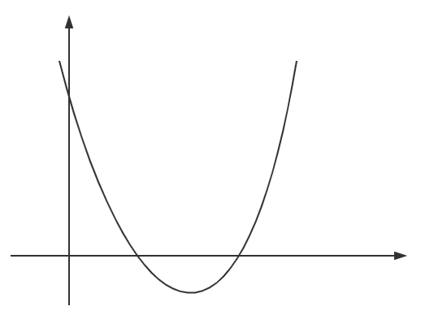
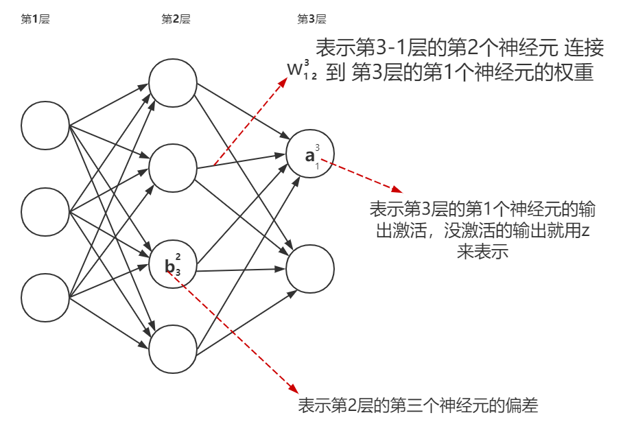

# 理解梯度下降和反向传播

梯度下降就是一个求极值的方法，在深度学习里面用于最小化损失来训练权重和偏差。

先举个简单的例子，

比如，我们要求如上曲线函数的极小值，我们只要对其求导然后找导数为0的点就可以了。

但是在实际情况会比这个要复杂的多，因为我们会有更多的变量，特别是对于神经网络而言，它可能以复杂的方式依赖于几十亿的权重和偏差，因此依靠微分来求极值显然是行不通的。

但是你想呀，我们有计算机呀，计算机最擅长什么？当然是硬算呀...

想必玩过猜数字游戏吧，你先随便猜一个，然后告知你大了还是小了，如果大了你就往小了猜，小了就往大了猜，如此循环往复就猜到对应的数字了。

梯度下降的过程也是有点类似的，就是你先随便选一个点，然后往减小的方向一点点移动，移动着移动着，你就到了那块最小的值的区域了。

那么，这个方向应该怎么确定呢？暂时先不去想它，假设我们就给我们的变量$v_1$随意移动了很小的一段 $\Delta v_1$,那么函数值$C$会发生多少变化呢？微积分告诉我们会这么改变：
$$
\Delta C \approx \frac{\partial C}{\partial v_1}\Delta v_1
$$
要让$C​$的值减小，就意味着我们要让$\Delta C​$为负。

在此之前，我们先把上面的偏导扩展到多元变量，即不止有一个变量$v_1$ ，而是有$v_1,v_2,...v_n$,我们将所有变量的偏导数组合在一起构成一个向量，将其称为梯度向量，即
$$
\triangledown C = [\frac{\partial C}{\partial v_1},\frac{\partial C}{\partial v_2},...,\frac{\partial C}{\partial v_n}]^T
$$
把所有发生的变化$\Delta v​$ 也写到一个向量里:
$$
\Delta v = [\Delta v_1, \Delta v_2,...,\Delta v_n]^T
$$
我们可以把$\Delta C ​$的表达式写成：
$$
\Delta C \approx \triangledown C · \Delta v
$$
观察上面的公式，容易想到的是，我们只要选择
$$
\Delta v = - \eta \triangledown C
$$
就可以保证$\Delta C$ 小于等于0了，其中$\eta$ 是一个小的正数（我们称之为学习速率或者是步长）。然后，我们就知道该如何移动这个点了：
$$
v \to v' = v -\eta\triangledown C
$$
然后让计算机使用这个规则，一遍一遍的迭代，就能让损失函数的值$C$ 达到我们希望的极小值。

总而言之，梯度下降算法的工作方式是反复计算梯度 $\triangledown C$ ，然后向相反方向移动。

那么，我们如何把它应用到神经网络的学习中？显而易见的，就是利用梯度下降来找到相应的权重$w_k$和偏差$b_l$，让损失函数的值尽可能的小。套用上面的公式，我们只要随机取一个$w_k$和$b_l$，利用更新的规则，就有了：
$$
w_k \to w'_k = w_k-\eta \frac{\partial C}{\partial w_k}
$$

$$
b_l \to b'_l = b_k-\eta \frac{\partial C}{\partial w_l}
$$

在来想一下我们网络损失函数的定义，当使用二次损失时，$C=\frac{1}{n}\sum_xC_x$,也就是说，神经网络中的损失，是所有训练样本损失的平均。但是，当数据集很大的时候，这会花费很长很长的时间，因此网络的学习速度会非常非常慢。于是就有了一种叫做随机梯度下降的思想来加速学习。

这个想法其实很简单，就是随机选取一个小的批次，然后只计算这个批次的平均损失，这样只要每个批次的平均损失都最小的话，那整体也就最小了。特别的，当这个批次只去一个样本的时候，神经网络一次只能从一个训练输入中学习，这种行为被称为在线学习。

okay，现在我们已经知道用梯度下降来让网络学习权重和偏差了，但是还有一个问题困扰着我们，就是你这个方法说起来简单，可是...可是这个梯度要怎么算呀？

然后一种快速计算梯度的算法，叫做**反向传播算法**就来了。

反向传播算法的核心在于如何通过最终的损失$C​$ 计算网络中任意位置的权值$w​$(或者偏差$b​$)的偏导$\frac{\partial C}{\partial w}​$。

很明显，其实最后一层的偏导是很好计算的，因为损失只要把样本$x$对应的标签$y$和输出激活$a​$，带到损失函数里就得到了，问题在于怎么计算前面层的损失。顾名思义，反向传播算法的精髓就是搞出了一种方法，可以把误差从后往前反向传播，这样就可以轻松的计算前面层权值的偏导了。

在开始正式讲解之前，我们先来定义几个符号：

根据上面的符号表达，我们可以很轻松的写出正向传播的递推公式，就上一层的的输出激活作为下一层的输入，然后经过线性运算再输出$\sigma​$激活，这里使用向量化的形式：
$$
a^l=\sigma(w^la^{l-1}+b^l)
$$
为了计算$\frac{\partial C}{\partial w^l_{jk}}​$ 和$\frac{\partial C}{\partial b^l_{j}}​$ ，我们引入一个中间变量$\delta^l_j​$,称其为第$l​$层的第$j​$个神经元的误差：
$$
\delta^l_j = \frac{\partial C}{\partial z^l_j}
$$
按照惯例，我们用$\delta^l$来代表第$l$层的误差向量。

根据微积分中求导的链式法则，有
$$
\delta^l_j = \frac{\partial C}{\partial a^l_j}\frac{\partial a^l_j}{\partial z^l_j}= \frac{\partial C}{\partial a^l_j}\sigma'(z^l_j)
$$
并且可以得到一个递推公式
$$
\delta^l_j =\sum_k \frac{\partial C}{\partial z^{l+1}_k} \frac{\partial z^{l+1}_k}{\partial z^l_j}=\sum_k \delta^{l+1}_k \frac{\partial z^{l+1}_k}{\partial z^l_j}\\ = \sum_k \delta^{l+1}_k \frac{\sum_j w^{l+1}_{kj}a^l_j+b^{l+1}_k}{\partial z^l_j}=\sum_k (\delta^{l+1}_k\sum_j w^{l+1}_{kj}\sigma'(z^l_j))
$$
写成矩阵的形式，就是
$$
\delta^l = ((w^{l+1})^T\delta^{l+1}) \bigodot \sigma'(z^l)
$$
这样我们就可以将误差从后往前传递了。

那么这个误差和我们的偏导$\frac{\partial C}{\partial w^l_{jk}}​$ 又有什么联系呢？还是根据链式法则：
$$
\frac{\partial C}{\partial w^l_{jk}} = \frac{\partial C}{\partial z^l_{jk}} \frac{\partial z^l_{jk}}{\partial w^l_{jk}}= \delta^l_j a^{l-1}_k
$$
到此，整个反向传播的过程就连起来了。求偏差的偏导使用同样的方法即可。

