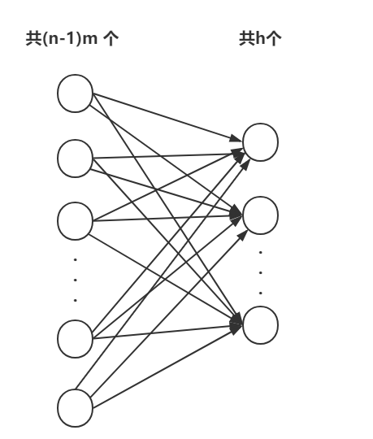

这里部分公式符号显示异常，可以看[这边的版本](https://www.jianshu.com/p/00427c9282b7)。

**语言模型**定义了自然语言中标记序列的概率分布,简单的说就是定义了任何一个句子可能出现的概率，比如“小明吃了个苹果”每100个句子中就会出现1次，那它的概率就是$0.01​$, 而"苹果吃了个小明"这个句子从古至今从来就不会有，那么就可以认为它的概率是$0​$.

一般的，假设一个句子有一连串的词$x_1, x_2, ...,x_t$组成，那么我们要怎么计算它在语言模型中的概率$P$ 呢？

最简单的想法就是我们构建一个巨大无比的语料库，把全人类从古至今讲过的话都放在里面，然后通过统计这句话出现的频率就可以了，但是显然是行不通的，我们没有这么大的语料库。

就算是有一个相对来说比较大的库，在其中的句子的概率相对来说还好算，只要频率除以总数就可以了，但是没有在这个库中的句子就会都变成0，显然这是不合理的。比如说在我们的库里，“小明吃了个苹果”概率0.01是可以理解的，但是“小明吃了个橘子”这句话并不在库里，那它的概率就应该为0吗？根据我们的直觉，“小明吃了个橘子”这个句子也是一个正常人类表达的句子，它不应该为0。

既然句子不行，那要不我们试试更细粒度的词汇，词汇在一个比较大的语料库中总归基本都是有出现的吧，于是我们可以定义一个条件概率：
$$
P(x_1,x_2,...,x_t)=P(x_1)P(x_2|x_1)P(x_3|x_1,x_2)P(x_4|x_1,x_2,x_3)···P(w_n|w_1,w_2,...,w_{t-1})
$$
观察上面的公式，前面的$P(x_1),P(x_2|x_1),P(x_3|x_1,x_2)​$ 还算比较好算，但是越后面...越没法算了....

这该如何是好？

## n-gram语言模型

于是有人就想出了 n-gram语言模型，它是最早成功的基于固定长度序列的标记模型。

它的思想来源于马尔可夫假设，它假设任意一个词$x_i​$ 出现的概率只和它前面的$n-1​$ 个词有关，而不是跟前面的所有词都有关，这样一来，前面的条件概率就变得简单了：
$$
P(x_1,...x_t)=P(x_1,...,x_{n-1})\prod^t_{t=n}P(x_t|x_{t-n+1},...,x_{t-1})
$$
特别的，当n=1时称为**一元语法**（unigram），n=2时称为**二元语法**(bigram)，n=3时称为**三元语法**（trigram),其中，三元语法是用的比较多的。显然，要训练**n-gram**语言模型是简单的，因为它的最大似然估计可以通过简单的统计每个可能的n-gram在语料库中出现的频率来获得。

通常我们同时训练n-gram模型和n-1 gram模型，这使得下面的式子可以简单的通过查找两个存储的概率来计算：
$$
P(x_t|x_{t-n+1},...x_{t-1})= \frac{P_n(x_{t-n+1},...x_t)}{P_{n-1}(x_{t-n+1,...,x_{t-1}})}
$$
举个例子，我们演示一下三元模型是如何计算句子“苹果 吃了 个 小明”的概率的,套用上面的公式：
$$
P(苹果,吃了,个,小明)=P_3(小明|苹果,吃了,个)P_3(苹果,吃了,个) \\ = \frac{P_3(吃了,个,小明)}{P_2(吃了，个)}P_3(苹果,吃了,个)
$$
显然，n-gram模型的最大似然有一个基本限制，就是有可能在语料库中的统计数据$P_n$可能是$0$,这将导致两种灾难性的后果。当$P_{n-1}=0$时，分母为0无法产生有意义输出，而当$P_n=0，P_{n-1} \ne 0$ 时，测试样本的对数似然为 $- \infty$  ,主要有两种方式来避免这种灾难性的后果：

- 一种平滑方式是基于所有可能的下一符号值添加非零的概率质量
- 另一种回退方法就是高阶和低阶混合模型，就是高阶为0取低阶

n-gram模型特别容易引起维数灾难，因为存在$|V|^n$可能的n-gram,而$|v|$通常很大，即使有大量训练数据和适当的$n$，大多数的n-gram也不会在训练集中出现。另外还有一个缺点就是模型词与词之间并没有什么关联，无法体现不同语义词汇之间的不同。

## 神经网络语言模型（NNLM）

NNLM是一类用来克服位数灾难的语言模型，它使用词的分布式表示来对自然语言序列建模,其中词的分布式表示其实就是众所周知的**词向量**。

下面我们就来介绍一下NNLM的网络结构。

它的本质其实是一个前馈网络，就是用一个句子词序列 $w_{t-n+1},w_{t-n+2},...,w_{t-1}$ 来预测下1个词（就记为$w_i$ 吧），因此它的输入是 $w_{t-n+1},w_{t-n+2},...,w_{t-1}$, 标签是$w_i$ ,模型训练的目的就是预测接近$w_i$的$w_i'$ ，因为输出层用的softmax激活，因此也可以理解成是输出$w_i$ 的概率。

下面，通过这个图，来看一下输入是怎么一步步到输出的。

 $w_{t-n+1},w_{t-n+2},...,w_{t-1}$是one-hot形式表示的词汇向量，它的维度等于总的词汇数。比如语料库只有4个词"小明"，"吃了"， “个”，"苹果"，那它们的one-hot向量就可以是4维向量：

总之就是词库有多少个不同的词，$w$就有几维，一般的词库而言可能会有几万维，然后每个次分别在自己的索引为为1，其余为0。

而look-up的作用就是要将one-hot的大维向量映射到一个分布式表示的相对低维的向量上，各自共享一个参数相同的全连接网络，通常会由200个左右的神经元，这里我们假设是$m$个，也就是从$|V|$ 维映射到$m$维：$Cw_t$

这样的映射过程有$n$-1个，把$Cw_{t-n+1},Cw_{t-n+2},...Cw_{t-1}$拼接在一起，就得到了一个$（n-1) * m$ 维的向量$x$,然后继续往前传播，传到一个全连接的隐层，有h个神经元，并通过$tanh$ 激活，得到一个h维的向量：$a = tanh(Hx+d)$

之后就是输出层了，输出的虽然是一个和输入$w_t$一样的|V|维向量,但是这个输出层的连接比较特殊，并不是普通的全连接，它和隐藏层的输入和输出都有关系$y=softmax(Wx+Ua+b)$, 就是词库中所有词的概率分布，然后用它和真实分布$w_i$计算交叉熵就是损失函数。

