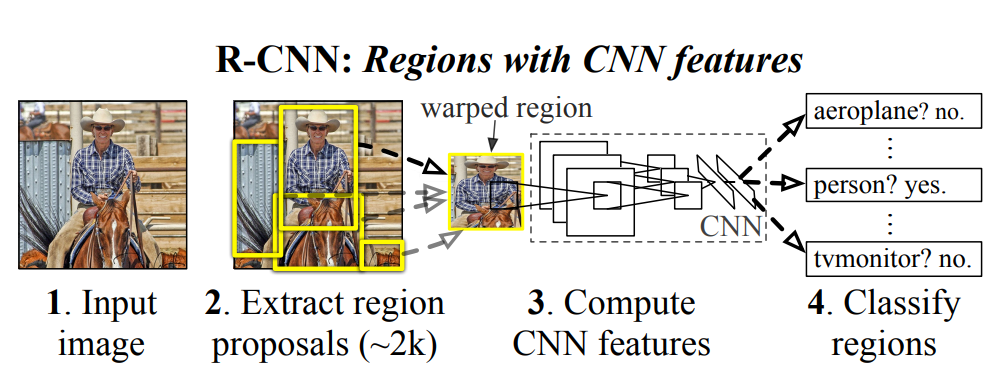

# 从RCNN到Faster RCNN

**从RCNN到Faster RCNN的原始论文**

[RCNN](https://arxiv.org/abs/1311.2524)

[Fast RCNN](https://arxiv.org/abs/1504.08083)

[Faster RCNN](https://arxiv.org/abs/1504.08083)

众所周知，CNN在图像的分类任务上已经取得了很好的效果。通过ImageNet的大量标注图片训练的很多模型分类效果都非常好，并且也可以非常方便迁移到其他的分类任务。而**目标检测**任务，除了要给目标的分类外，另一个更加困难的地方在于它需要识别出目标在整个图片中的位置。

**RCNN**(Region Based Convolution Neural Network) 算是目标检测的开山之作了，它的目标是获得一个图像，并且识别出主要对象在图像中的位置(通过绘制一个边界框)。

先看一下它的实现流程：

 

1. **输入：**入与普通的CNN一样，是一张图片
2. 区域建议：[Selective Search]()的方式生成大约2000个候选框
3. 特征提取：