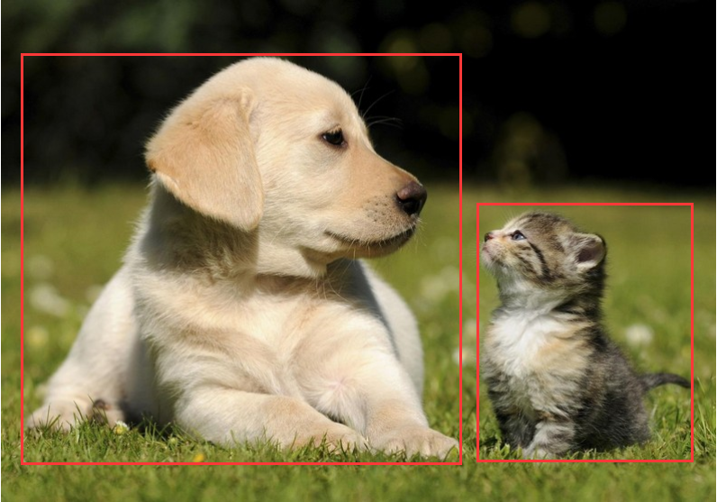
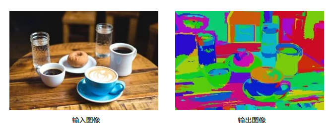
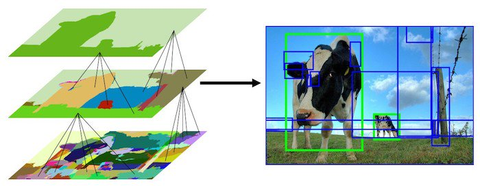

# Selective Search原理

在目标检测中，我们不仅需要识别出图像中存在哪些类别的对象，还需要输出它们的**边界框（bounding boxes）**,它包含四个变量边界框的坐标$x, y$ 以及边界框的长和高$width, height$ 来指示对象在图片中的位置。

对象分类的识别相对来说是比较容易实现的，只需要训练一个深层的卷积网络模型，让这个模型可以识别出图像块中是否包含相应的对象。比如识别出图片里有没有猫，或者有没有狗，但是它并不会告诉你这猫或狗在图片中的什么位置。

因此我们需要一张方法，来生成一个子区域，来标识出具体对象的位置。

最简单的想法就是通过滑动窗口的方式来实现，即通过生成各种大小不同的小的窗口，在整个图片上滑动，通过对每个块进行分类继而找到最佳的窗口刚好把对象框起来了。这是对整个图像上对象的细致的搜索，我们不仅需要搜索图像中的所有可能位置，而且还必须通过不同比例及大小的窗口进行搜索，这意味着有成千上万个图像块需要进行分类，对于形状相对固定的对象还好，对于因不同拍摄角度导致的形状变化，搜索范围会变得非常非常大，因此计算量大到几乎没法用。

但是好在这种方法的限制被一类称为“**Region Proposal**” 的算法给克服了，而**Selective Search** 正是目前最流行有效的**Region Proposal**算法之一，因为它速度快而且召回率高。

那么，**Selective Search** 是怎么工作的呢？

Selective Search首先使用Felzenszwalb和Huttenlocher的基于图像的分割方法，根据**像素的强度**对图像进行**分割**。该算法的输出如下图所示，右边的图像包含了用纯色表示的分割区域。

那么，我们可以直接使用这幅图里面的分割部分作为Region Proposal吗？自然是不行的，原因有两点：

- 原始的实际对象包含了多个分割部分
- 这种方式无法生成遮挡物的Region Proposal，例如被杯子覆盖的盘子..

先来解决第一个问题。既然是被过度分割了，那不如我们就想个办法来把有必要合并的分割给它合并起来，毕竟完美的分割并不是我们的目的所在，而是希望我们所预测的这些Proposal尽可能的有一些能够和实际对象高度重叠。

**Selective Search**将过度分割的图像作为初始输入，然后执行以下步骤：

1. 将分割块所对应的边界框(bounding box)全部添加到Region Proposal列表中
2. 根据**相似度**对相邻的分割块合并
3. 继续步骤1

在每次迭代中，形成更大的片段并且添加到Region Proposal列表中。因此，我们采用自底向上的方法，从较小的部分到较大的部分创建区域建议（Region Proposal），这样同时也解决了遮挡层次的问题。

上图展示了图像分割从初始到最后的过程。

那么我们应该怎么计算两个区域之间的相似性？Selective Search使用4种基于颜色、纹理、大小、形状相容性的相似性度量。

### 颜色相似度

每个通道计算25个bin的颜色直方图，并将所有通道的直方图连接起来，得到一个25*3=75维的颜色描述符。两个区域的颜色相似度是基于直方图相交的，可以计算为：
$$
s_{color}(r_i, r_j)=\sum^n_{k=1}min(c^k_i,c^k_j)
$$
$c^k_i​$ 是颜色描述符中$k^{th}​$ bin 的直方图值。

### 纹理相似度

通过对每个通道提取8个方向的高斯导数来计算纹理特征。对于每个方向和每个颜色通道，计算一个10-bin直方图，得到一个10\*8\*3 = 240维特征描述符。

利用直方图交点计算两个区域的纹理相似度。
$$
s_{texture}(r_i, r_j)=\sum^n_{k=1}min(t^k_i,t^k_j)
$$
$t^k_i$ 是纹理描述符中$k^{th}$ bin 的直方图值。

### 大小相似度

大小相似度鼓励较小的区域尽早合并。它确保在所有尺度的区域建议在图像的所有部分形成。如果不考虑这种相似性度量，单个区域将一个接一个地吞噬所有较小的相邻区域，因此在多个尺度上的区域建议将只在这个位置生成。大小相似度定义为:
$$
s_{size}(r_i,r_j) = 1 - \frac{size(r_i)+size(r_j)}{size(im)}
$$
其中，$size(im)$ 是图像的像素大小。

### 形状相似度

形状相似度量两个区域($r_i$和$r_j$)相互适应的程度。如果$r_i $ 符合$r_j$ ，我们想合并它们，以填补空白，如果它们甚至不接触，它们不应该合并。

形状相似度定义为:
$$
s_{fill}(r_i,r_j) = 1 - \frac{size(BB_{ij})-size(r_i)-size(r_j)}{size(im)}
$$
其中$size(BB_{ij})$ 是围绕$r_i$ 和 $r_j $ 的边界框。

### 最终相似度

最终相似度是以上4中相似度的线性组合：
$$
s(r_i, r_j) = a_1s_{color}(r_i, r_j) + a_2s_{texture}(r_i, r_j) + a_3s_{size}(r_i, r_j) + a_4s_{fill}(r_i, r_j)
$$
其中$r_i$和$r_j$ 是图像中的两个区域或片段，$a_i \in {0，1}$表示是否使用了相似性度量。

OpenCV中的Selective Search提供了成千上万个区域建议（Region Proposal）, 这些建议按照客观性从高到低的顺序排序。一般而言，我们会选择前1000到2000个建议就足以满足正确的Region Proposal。

### 参考资料

[Selective Search for Object Detection](<https://www.learnopencv.com/selective-search-for-object-detection-cpp-python/>)