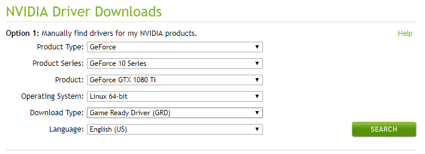
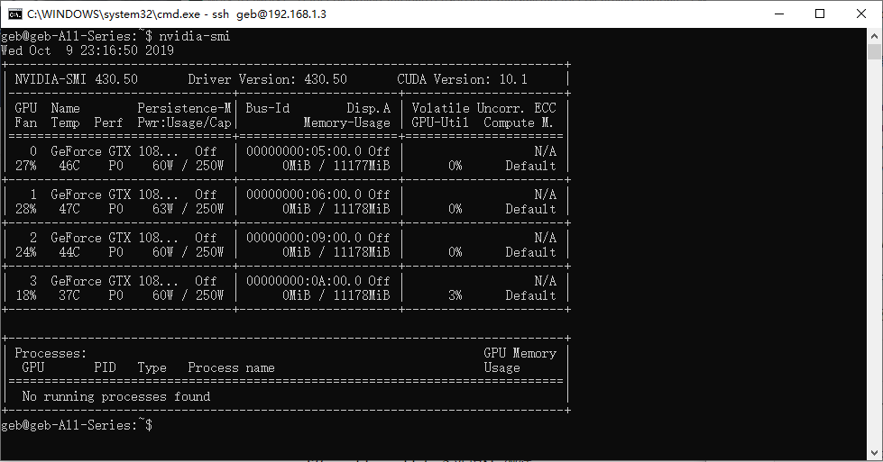
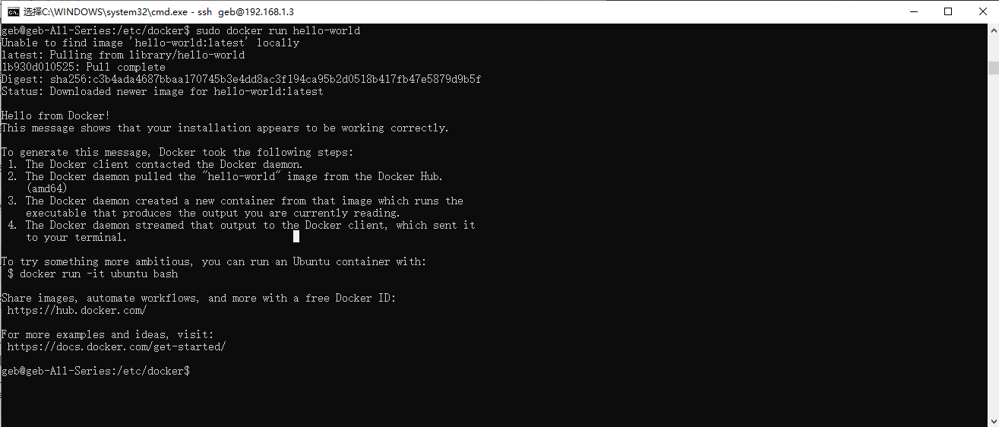
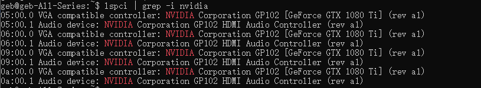
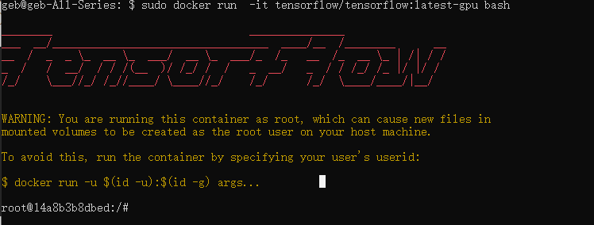

# Ubuntu 18.04 安装 TensorFlow2.0 GPU版

鉴于目前官方提倡我们在Docker中运行TensorFlow，并且现在Docker版本也已经有了GPU的支持，安装也相对简单，于是此文就介绍Docker版的安装方式。


## 安装显卡驱动

首先，我们要去安装显卡驱动[NVIDIA® GPU drivers](https://www.nvidia.com/drivers) ，CUDA 10.0 requires 410.x or higher.

公司解散后，我把训练模型的4卡并联的机器留下来了，用的是当年性价比最高的GPU——GTX 1080TI：



你选择自己的GPU型号，点击Search，然后下载对应的驱动程序。

```shell
wget https://us.download.nvidia.cn/XFree86/Linux-x86_64/430.50/NVIDIA-Linux-x86_64-430.50.run
```

先别急着安装，因为没做前置工作会带来各种失败。

在安装这个之前，我们还需要几个准备工作：

### 安装gcc

如果你的系统没装gcc的话，需要先安装，安装方式如下：

```
sudo apt install build-essential
```

上面的语句会安装`build-essential`包，该命令将安装一组新的包，包括gcc、g++和make。

你也可以安装使用GNU/Linux进行开发的手册页:

```
sudo apt-get install manpages-dev
```

要验证GCC编译器是否成功安装，可以使用`gcc --version`命令，该命令将打印GCC版本。

### 禁用 nouveau 驱动

**(nouveau 就是linux 下的一个兼容性很好，但是功能不怎样的显卡驱动)**

将其加入到黑名单,运行`sudo vim /etc/modprobe.d/blacklist.conf`，在文件末尾添加以下几行：

```
blacklist vga16fb
blacklist nouveau
blacklist rivafb
blacklist rivatv
blacklist nvidiafb 
```

### 关闭 X server

X server 就是图形接口服务器

使用以下语句关闭

```
sudo service lightdm stop
```

如果提示unit lightdm.service not loaded，那就先安装它：

```
sudo apt install lightdm
```

安装完毕后跳出一个界面，选择lightdm，再`sudo service lightdm stop`，如果选择了gdm，那就运行`sudo /etc/init.d/gdm stop`

### 安装驱动

```
sudo chmod a+x NVIDIA-Linux-x86_64-430.50.run
sudo NVIDIA-Linux-x86_64-430.50.run
```

重启电脑，输入

```
nvidia-smi
```

如果看到各个显卡的信息，就说明安装成功了




## 安装Docker Engine

如果你的电脑还没装Docker Engine的话，让我们先安装它。

如果你安装了旧版的Docker，可以先卸载它：

```
sudo apt-get remove docker docker-engine docker.io containerd runc
```

然我我们根据[官方教程](https://docs.docker.com/install/linux/docker-ce/ubuntu/)安装Docker Engine - Community。

这里咱使用存储库安装的方式。

### 设置存储库

1.更新apt包索引：

```
sudo apt-get update
```

2.安装软件包以允许`apt`通过HTTPS使用存储库：

```
sudo apt-get install \
    apt-transport-https \
    ca-certificates \
    curl \
    gnupg-agent \
    software-properties-common
```

3.添加Docker的官方GPG密钥：

```
curl -fsSL https://download.docker.com/linux/ubuntu/gpg | sudo apt-key add -
```

`9DC8 5822 9FC7 DD38 854A E2D8 8D81 803C 0EBF CD88`通过搜索指纹的后8个字符，验证您现在是否拥有带有指纹的密钥 。

```
sudo apt-key fingerprint 0EBFCD88
```

4.使用以下命令来设置**稳定的**存储库

```
sudo add-apt-repository \
   "deb [arch=amd64] https://download.docker.com/linux/ubuntu \
   $(lsb_release -cs) \
   stable"
```

### 安装Docker Engine 社区版

装这个鬼东西建议翻墙...不然死慢死慢的......

```
sudo apt-get update
sudo apt-get install docker-ce docker-ce-cli containerd.io
```

通过运行`hello-world`来验证是否正确安装：

这个命令可能需要设置国内镜像...不然..很可能没法连接..

```
 sudo docker run hello-world
```

此命令下载测试图像并在容器中运行。容器运行时，它会打印参考消息并退出。




## 安装 [nvidia-docker](https://github.com/NVIDIA/nvidia-docker)

`nvidia-docker` 仅适用于 Linux

检查GPU是否可用

```
lspci | grep -i nvidia
```



安装nvidia-docker

```
sudo apt-get install -y nvidia-docker2
sudo systemctl daemon-reload
sudo systemctl restart docker
```

验证 `nvidia-docker` 安装：

```
sudo docker run --runtime=nvidia --rm nvidia/cuda nvidia-smi
```

这个地方可能会有一个很坑爹报错：`docker: Error response from daemon: Unknown runtime specified nvidia.`因为我一开始是按照github上的方法安装nvidia-docker的，后来改用apt来装就好了，如果还有问题，

可以重新写了下`/etc/docker/daemon.json`文件，我是这么写的：

```
{
  "registry-mirrors": [
    "https://dockerhub.azk8s.cn",
    "https://reg-mirror.qiniu.com"
  ],
  "runtimes": {
        "nvidia": {
            "path": "/usr/bin/nvidia-container-runtime",
            "runtimeArgs": []
         }	
    }
}
```

## 下载并运行支持 GPU 的 TensorFlow 映像

```
sudo docker run -it --rm --runtime=nvidia tensorflow/tensorflow:latest-gpu-py3 python
```

设置支持 GPU 的映像可能需要一段时间。如果重复运行基于 GPU 的脚本，您可以使用 `docker exec` 重用容器。

使用最新的 TensorFlow GPU 映像在容器中启动 `bash` shell 会话：

```
 sudo docker run -it tensorflow/tensorflow:latest-gpu-py3 bash
```




ok,到这里大功告成了。

可以进入python环境试一下：

```
import tensorflow as tf
print(tf.reduce_sum(tf.random_normal([1000, 1000])))
```

